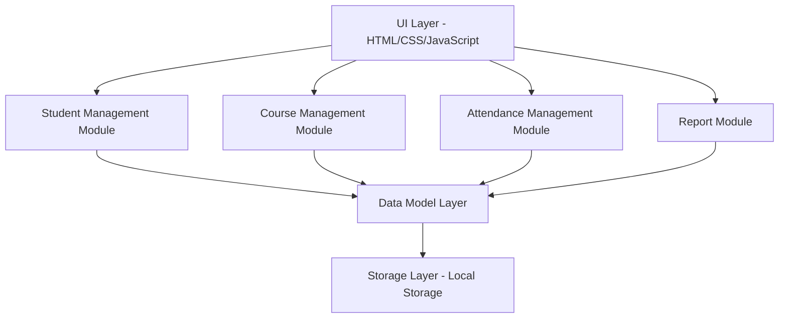
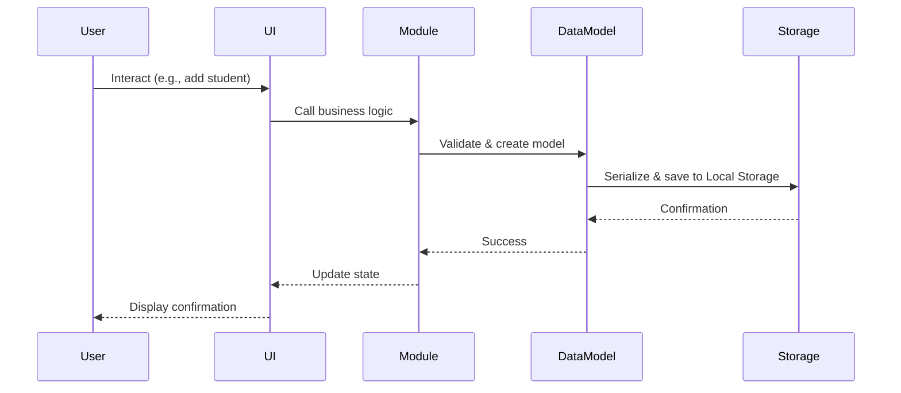

# Design Document: Student Attendance Manager

## Overview

The Student Attendance Manager is a client-side web application for tracking student attendance across multiple courses. Built entirely with HTML, CSS, and JavaScript, it operates without a backend, storing all data in the browser's Local Storage. The application provides comprehensive student and course management, attendance recording with historical tracking, automated risk detection for students with high absence rates, and statistical reporting capabilities.

### Key Design Principles

1. **Client-Side Architecture**: All logic executes in the browser; no server-side components
2. **Local-First Data**: Browser Local Storage serves as the sole persistence mechanism
3. **Modular Design**: Clear separation between data models, business logic, storage, and UI layers
4. **Responsive Interface**: Adapts to different screen sizes for desktop and mobile use
5. **Data Integrity**: Validation at multiple layers ensures consistency and reliability

### Technology Stack

- **HTML5**: Semantic markup for structure
- **CSS3**: Styling with responsive design using media queries
- **JavaScript (ES6+)**: Application logic, DOM manipulation, and data management
- **Local Storage API**: Browser-based persistence

## Architecture

The application follows a modular, layered architecture with clear separation of concerns:



### Architectural Layers

#### 1. UI Layer
- **Responsibility**: User interaction, rendering, and navigation
- **Components**: 
  - Navigation menu
  - Student list and forms
  - Course list and forms
  - Attendance recording interface
  - Report views
  - Search and filter controls
- **Technology**: HTML for structure, CSS for styling, JavaScript for interactivity

#### 2. Business Logic Modules
- **Student Management Module**: CRUD operations for students
- **Course Management Module**: CRUD operations for courses
- **Attendance Management Module**: Recording, editing, and enrollment management
- **Report Module**: Statistics calculation, risk detection, and report generation

#### 3. Data Model Layer
- **Responsibility**: Data structures, validation, and relationships
- **Components**: Student, Course, AttendanceRecord, Enrollment models
- **Functions**: Validation, data integrity checks, relationship management

#### 4. Storage Layer
- **Responsibility**: Persistence to and retrieval from Local Storage
- **Operations**: serialize, deserialize, save, load, error handling

### Data Flow



**Key Data Flow Patterns**:

1. **Create Operations**: UI → Module → Validate → DataModel → Storage → Success confirmation
2. **Read Operations**: UI → Module → Storage → DataModel → Render in UI
3. **Update Operations**: UI → Module → Validate → DataModel → Storage → Recalculate statistics → Update UI
4. **Delete Operations**: UI → Confirmation dialog → Module → DataModel → Cascade delete related records → Storage → Update UI

## Components and Interfaces

### Module Architecture

#### Student Management Module

**Purpose**: Manage student records and related operations

**Public Interface**:
```javascript
StudentModule = {
  addStudent(name, studentId, email): { success, student, errors }
  getStudent(studentId): Student | null
  getAllStudents(): Student[]
  updateStudent(studentId, updates): { success, student, errors }
  deleteStudent(studentId): { success, errors }
  searchStudents(searchText): Student[]
  getAtRiskStudents(): Array<{ student, courses }>
}
```

**Responsibilities**:
- Validate student data (name format, ID uniqueness, email format)
- Create, read, update, delete student records
- Search and filter student lists
- Coordinate with Attendance Module for cascade delete

#### Course Management Module

**Purpose**: Manage course records and enrollment relationships

**Public Interface**:
```javascript
CourseModule = {
  addCourse(name, code, description): { success, course, errors }
  getCourse(courseCode): Course | null
  getAllCourses(): Course[]
  updateCourse(courseCode, updates): { success, course, errors }
  deleteCourse(courseCode): { success, attendanceCount, errors }
  enrollStudent(studentId, courseCode): { success, errors }
  unenrollStudent(studentId, courseCode): { success, errors }
  getEnrolledStudents(courseCode): Student[]
  getStudentCourses(studentId): Course[]
}
```

**Responsibilities**:
- Validate course data (name length, code uniqueness, description length)
- Create, read, update, delete course records
- Manage student-course enrollment relationships
- Prevent course code modification after creation
- Coordinate with Attendance Module for cascade delete

#### Attendance Management Module

**Purpose**: Record and manage attendance data

**Public Interface**:
```javascript
AttendanceModule = {
  recordAttendance(courseCode, date, records): { success, errors }
  getAttendance(courseCode, date): AttendanceRecord[]
  getStudentAttendance(studentId, courseCode?): AttendanceRecord[]
  getCourseAttendance(courseCode): AttendanceRecord[]
  updateAttendanceRecord(recordId, status): { success, errors }
  calculateAbsenceRate(studentId, courseCode): number
  calculateAtRiskStatus(studentId, courseCode): boolean
  recalculateStatistics(studentId, courseCode): void
}
```

**Responsibilities**:
- Record attendance for course sessions
- Validate attendance data (date format, future date prevention)
- Edit existing attendance records
- Calculate absence rates: (absences / total sessions) × 100
- Detect at-risk status (≥30% absence rate)
- Recalculate statistics after data changes

#### Report Module

**Purpose**: Generate statistics and reports

**Public Interface**:
```javascript
ReportModule = {
  generateCourseReport(courseCode): CourseReport
  generateStudentReport(studentId): StudentReport
  getCourseSummaries(): CourseSummary[]
  getStudentSummaries(): StudentSummary[]
  getAtRiskList(): AtRiskEntry[]
}
```

**Responsibilities**:
- Calculate aggregate statistics per course
- Calculate aggregate statistics per student
- Generate at-risk student lists
- Format percentages and visual indicators
- Handle edge cases (no data, zero sessions)

#### Storage Layer

**Purpose**: Persist and retrieve data from Local Storage

**Public Interface**:
```javascript
StorageLayer = {
  initialize(): { success, data, errors }
  saveData(data): { success, errors }
  loadData(): { success, data, errors }
  handleStorageError(error): ErrorMessage
}
```

**Responsibilities**:
- Serialize data to JSON
- Deserialize JSON to data structures
- Handle Local Storage quota exceeded errors
- Handle parsing errors and corrupted data
- Initialize empty data structures on first load

### UI Components

#### Navigation Component
- Horizontal menu (desktop: ≥768px)
- Collapsible vertical menu (mobile: <768px)
- Active section highlighting
- Breadcrumb navigation for detail views

#### Student List Component
- Display all students (name, ID)
- Search input with real-time filtering (<500ms)
- At-risk filter toggle
- Add/Edit/Delete actions
- Warning icons for at-risk students

#### Course List Component
- Display all courses (name, code)
- Add/Edit/Delete actions
- Confirmation dialogs with attendance count

#### Attendance Recording Component
- Course and date selector
- List of enrolled students
- Present/Absent toggle controls
- Save functionality with validation
- Load existing attendance for editing

#### Report Components
- Course summary table (name, sessions, average absence rate)
- Student summary table (name, absence rates by course)
- At-risk student list (sorted by absence rate)
- Color-coded visual indicators (green: 0-10%, yellow: 10-30%, red: ≥30%)

#### Common UI Elements
- Loading indicators (<100ms display)
- Success messages (3-second duration)
- Error messages (persistent until dismissed)
- Confirmation dialogs
- Form validation messages
- Help text and tooltips

## Data Models

### Student

**Properties**:
- `id`: string (UUID, generated on creation, immutable)
- `studentId`: string (1-50 chars, unique, immutable after creation)
- `name`: string (1-100 chars, letters/spaces/hyphens/apostrophes only)
- `email`: string (valid email format)
- `createdAt`: timestamp
- `updatedAt`: timestamp

**Validation Rules**:
- `name`: Required, 1-100 chars, pattern: `/^[A-Za-z\s'-]+$/`
- `studentId`: Required, 1-50 chars, unique across all students
- `email`: Required, valid email format
- Whitespace trimmed before validation

**Relationships**:
- Many-to-Many with Courses (via Enrollment)
- One-to-Many with AttendanceRecords

### Course

**Properties**:
- `id`: string (UUID, generated on creation, immutable)
- `courseCode`: string (1-20 chars, unique, immutable after creation)
- `name`: string (1-200 chars)
- `description`: string (0-1000 chars)
- `createdAt`: timestamp
- `updatedAt`: timestamp

**Validation Rules**:
- `name`: Required, 1-200 chars
- `courseCode`: Required, 1-20 chars, unique across all courses, immutable after creation
- `description`: Optional, 0-1000 chars
- Whitespace trimmed before validation

**Relationships**:
- Many-to-Many with Students (via Enrollment)
- One-to-Many with AttendanceRecords

### AttendanceRecord

**Properties**:
- `id`: string (UUID, generated on creation, immutable)
- `studentId`: string (foreign key to Student)
- `courseCode`: string (foreign key to Course)
- `date`: string (YYYY-MM-DD format)
- `status`: enum ('present' | 'absent')
- `createdAt`: timestamp
- `updatedAt`: timestamp

**Validation Rules**:
- `studentId`: Required, must reference existing Student
- `courseCode`: Required, must reference existing Course
- `date`: Required, YYYY-MM-DD format, not in the future
- `status`: Required, must be 'present' or 'absent'

**Constraints**:
- Unique combination of (studentId, courseCode, date)
- Date cannot be in the future

**Relationships**:
- Many-to-One with Student
- Many-to-One with Course

### Enrollment

**Properties**:
- `studentId`: string (foreign key to Student)
- `courseCode`: string (foreign key to Course)
- `enrolledAt`: timestamp

**Validation Rules**:
- `studentId`: Required, must reference existing Student
- `courseCode`: Required, must reference existing Course

**Constraints**:
- Unique combination of (studentId, courseCode)

**Relationships**:
- Many-to-One with Student
- Many-to-One with Course

### Computed Data Structures

#### AbsenceRate (computed, not stored)
- `studentId`: string
- `courseCode`: string
- `totalSessions`: number (count of AttendanceRecords)
- `absences`: number (count where status = 'absent')
- `presences`: number (count where status = 'present')
- `rate`: number (absences / totalSessions × 100, rounded to 1 decimal)

**Calculation**: Triggered after any AttendanceRecord create/update/delete

#### AtRiskStatus (computed, not stored)
- `studentId`: string
- `courseCode`: string
- `isAtRisk`: boolean (true if absence rate ≥ 30.0%)

**Calculation**: Triggered after absence rate recalculation

### Local Storage Data Structure

**Key**: `studentAttendanceManager`

**Value** (JSON):
```json
{
  "students": [
    {
      "id": "uuid",
      "studentId": "string",
      "name": "string",
      "email": "string",
      "createdAt": "timestamp",
      "updatedAt": "timestamp"
    }
  ],
  "courses": [
    {
      "id": "uuid",
      "courseCode": "string",
      "name": "string",
      "description": "string",
      "createdAt": "timestamp",
      "updatedAt": "timestamp"
    }
  ],
  "attendanceRecords": [
    {
      "id": "uuid",
      "studentId": "string",
      "courseCode": "string",
      "date": "YYYY-MM-DD",
      "status": "present|absent",
      "createdAt": "timestamp",
      "updatedAt": "timestamp"
    }
  ],
  "enrollments": [
    {
      "studentId": "string",
      "courseCode": "string",
      "enrolledAt": "timestamp"
    }
  ]
}
```

**Initialization**: If key not found or data is invalid, initialize with:
```json
{
  "students": [],
  "courses": [],
  "attendanceRecords": [],
  "enrollments": []
}
```

## Correctness Properties

**This section is intentionally omitted because property-based testing is not applicable to this feature.**

### Why Property-Based Testing Does Not Apply

This application is a client-side CRUD system with UI rendering and Local Storage integration. Property-based testing (PBT) is designed for testing universal properties across large input spaces in pure functions with complex transformation logic. This application does not fit that profile because:

1. **CRUD Operations**: The application performs simple create, read, update, and delete operations with no complex algorithmic transformations that would benefit from randomized input testing.

2. **UI Rendering**: Visual components, layout, and user interactions are better validated through snapshot tests, visual regression tests, and manual testing rather than property-based approaches.

3. **Storage Integration**: Local Storage operations are deterministic and straightforward—data is serialized to JSON, stored, and retrieved. These behaviors are best tested with concrete example-based integration tests.

4. **Validation Logic**: Input validation rules (name format, length constraints, uniqueness checks) are specific constraints best verified with concrete test cases covering valid inputs, invalid inputs, and edge cases.

5. **Business Logic**: Calculations like absence rate `(absences / totalSessions) × 100` and at-risk detection (`rate >= 30%`) are simple formulas that can be thoroughly tested with a small set of representative examples rather than hundreds of randomized iterations.

### Testing Approach for This Feature

According to the Kiro workflow guidance, when features involve:
- Infrastructure as Code (IaC)
- UI rendering and layout
- Simple CRUD operations with no transformation logic
- Configuration validation
- Side-effect-only operations

**Property-based testing should be skipped entirely** in favor of more appropriate testing strategies.

**For this application, we will use**:
- **Unit tests** for validation functions, calculation logic, and business rules (see Testing Strategy section)
- **Integration tests** for Local Storage operations and module interactions  
- **UI tests** for user interactions, form submissions, and rendering
- **Manual testing** for responsive design and cross-browser compatibility

This approach provides appropriate and comprehensive coverage for a CRUD application without the overhead of property-based testing infrastructure that would not add value to this type of system.

### No Correctness Properties Defined

Since property-based testing is not applicable, **no correctness properties are defined for this feature**. All testing requirements are detailed in the Testing Strategy section below.

### Property 0: N/A - Property-Based Testing Not Applicable

*This is a placeholder to satisfy spec format requirements. No actual properties are defined because property-based testing is not suitable for this CRUD application with UI rendering and Local Storage integration.*

**Rationale**: As documented above, this feature type (client-side CRUD with UI and storage) should use unit tests, integration tests, and UI tests instead of property-based testing.

**Validates: Requirements 0.0**

## Error Handling

### Validation Errors

**Strategy**: Fail fast with clear, user-friendly messages

**Implementation**:
- Validate at UI layer (immediate feedback)
- Validate at module layer (business rules)
- Validate at data model layer (data integrity)

**Error Response Format**:
```javascript
{
  success: false,
  errors: [
    { field: 'name', message: 'Name must be between 1 and 100 characters' },
    { field: 'studentId', message: 'Student ID must be unique' }
  ]
}
```

**Common Validation Errors**:
- Empty required fields
- Length constraints violated
- Format constraints violated (name pattern, email format, date format)
- Uniqueness constraints violated (student ID, course code)
- Reference integrity violations (invalid student/course IDs in attendance records)
- Future date prevention for attendance

### Storage Errors

**Error Types**:
1. **Quota Exceeded**: Local Storage is full
2. **Parse Error**: Corrupted JSON data
3. **Missing Fields**: Data structure lacks required properties
4. **Read Failure**: Cannot access Local Storage
5. **Write Failure**: Cannot write to Local Storage

**Handling Strategy**:

| Error Type | User Message | Recovery Action |
|------------|--------------|-----------------|
| Quota Exceeded | "Storage is full. Please delete old records." | Allow continued use; display warning on each save |
| Parse Error | "Data corrupted. Initializing fresh start." | Reset to empty data structures |
| Missing Fields | "Invalid data format. Initializing fresh start." | Reset to empty data structures |
| Read Failure | "Cannot access local storage. Check browser settings." | Initialize empty data; display persistent error |
| Write Failure | "Failed to save data. Changes may be lost." | Display error; allow retry |

**Error Logging**:
- Log errors to console for debugging
- Display user-friendly messages in UI
- Provide actionable recovery steps

### User Input Errors

**Strategy**: Prevent invalid states through UI design and progressive disclosure

**Examples**:
- Disable submit buttons until forms are valid
- Show validation errors inline as user types (debounced)
- Prevent deletion without confirmation
- Prevent marking attendance for future dates
- Require all students marked before saving attendance

**Error Display**:
- Inline field errors (red text below input)
- Form-level errors (summary at top)
- Toast notifications for transient errors
- Modal dialogs for critical errors

### Cascade Delete Handling

**Student Deletion**:
1. Count related attendance records
2. Display confirmation: "Delete [Name]? This will remove X attendance records."
3. On confirm: Delete student → Delete enrollments → Delete attendance records → Update storage
4. On cancel: Abort operation

**Course Deletion**:
1. Count related attendance records
2. Display confirmation: "Delete [Course Name]? This will remove X attendance records."
3. On confirm: Delete course → Delete enrollments → Delete attendance records → Update storage
4. On cancel: Abort operation

### Edge Cases

| Scenario | Handling |
|----------|----------|
| No enrolled students in course | Display "No students enrolled in this course" |
| No attendance records for student | Display "No attendance history available" |
| Zero sessions recorded in course | Display "N/A" for average absence rate |
| Editing attendance for non-enrolled student | Prevent by only showing enrolled students |
| Duplicate attendance record | Prevent by checking (student, course, date) uniqueness |
| Invalid Local Storage data | Reset to empty state with error message |
| Browser without Local Storage | Display error: "Local Storage required" |

## Testing Strategy

### Testing Approach

The Student Attendance Manager is a client-side CRUD application with UI rendering and Local Storage integration. Property-based testing is **not appropriate** for this type of application because:

1. **CRUD operations**: Simple create/read/update/delete with no complex transformation logic
2. **UI rendering**: Visual components and layout are better tested with snapshot or visual regression tests
3. **Storage integration**: Local Storage behavior is deterministic and best tested with example-based integration tests
4. **Business rules**: Validation and calculation logic (e.g., absence rate) can be tested with concrete examples

**Testing will focus on**:
- **Unit tests** for validation logic, calculation functions, and business rules
- **Integration tests** for Local Storage operations and module interactions
- **UI tests** for user interactions and rendering
- **Manual testing** for responsive design and cross-browser compatibility

### Unit Testing

**Target**: Pure functions and business logic in isolation

**Test Categories**:

#### Validation Functions
- Student name validation (letters, spaces, hyphens, apostrophes; 1-100 chars)
- Student ID validation (1-50 chars, uniqueness check)
- Email validation (valid email format)
- Course code validation (1-20 chars, uniqueness check)
- Course name validation (1-200 chars)
- Course description validation (0-1000 chars)
- Date format validation (YYYY-MM-DD)
- Future date prevention
- Whitespace trimming

**Example Tests**:
```javascript
// Valid inputs
test('accepts valid student name "John O\'Brien-Smith"')
test('accepts valid email "student@example.com"')
test('accepts valid date "2024-01-15"')

// Invalid inputs
test('rejects student name with numbers "John123"')
test('rejects student name over 100 chars')
test('rejects empty course name')
test('rejects duplicate course code')
test('rejects future date for attendance')

// Edge cases
test('trims whitespace from inputs')
test('handles empty string inputs')
test('handles special characters in names')
```

#### Calculation Functions
- Absence rate calculation: (absences / totalSessions) × 100
- At-risk status determination (≥30% threshold)
- Statistics aggregation

**Example Tests**:
```javascript
test('calculates absence rate: 3 absences / 10 sessions = 30.0%')
test('calculates absence rate: 0 absences / 5 sessions = 0.0%')
test('rounds absence rate to 1 decimal place')
test('sets at-risk status true when rate >= 30.0%')
test('sets at-risk status false when rate < 30.0%')
test('handles zero sessions (N/A case)')
```

#### Business Logic
- Student CRUD operations
- Course CRUD operations
- Attendance record creation/editing
- Enrollment management
- Search and filter logic

**Example Tests**:
```javascript
test('creates student with valid data')
test('prevents student creation with duplicate ID')
test('prevents course code modification after creation')
test('cascades delete student to remove attendance records')
test('filters students by search text (case-insensitive)')
test('filters at-risk students correctly')
test('enrolls student in course')
test('prevents duplicate enrollment')
```

### Integration Testing

**Target**: Module interactions and Local Storage operations

**Test Categories**:

#### Storage Operations
- Save data to Local Storage
- Load data from Local Storage
- Handle corrupted JSON data
- Handle missing fields
- Handle quota exceeded
- Initialize empty data structures

**Example Tests**:
```javascript
test('saves and loads student data from Local Storage')
test('initializes empty data on first load')
test('recovers from corrupted JSON data')
test('handles missing required fields in stored data')
test('displays error on quota exceeded')
```

#### Module Interactions
- Student deletion triggers attendance record deletion
- Course deletion triggers attendance record deletion
- Attendance recording recalculates absence rate
- Attendance editing recalculates at-risk status
- Enrollment affects attendance recording interface

**Example Tests**:
```javascript
test('deleting student removes all associated attendance records')
test('deleting course removes all associated attendance records')
test('recording attendance updates absence rate')
test('editing attendance updates at-risk status')
test('only enrolled students appear in attendance recording')
```

### UI Testing

**Target**: User interactions and rendering

**Test Categories**:

#### User Interactions
- Form submission
- Keyboard navigation (Tab, Enter)
- Search input with debouncing
- Confirmation dialogs
- Navigation menu
- Responsive layout

**Example Tests**:
```javascript
test('submits student form on Enter key')
test('navigates form fields with Tab key')
test('updates search results within 500ms')
test('shows confirmation dialog before deletion')
test('displays success message for 3 seconds')
test('shows loading indicator within 100ms')
test('collapses navigation menu on mobile (<768px)')
```

#### Rendering
- Student list rendering
- Course list rendering
- Attendance table rendering
- Report tables rendering
- Color-coded indicators (green/yellow/red)
- Warning icons for at-risk students

**Example Tests**:
```javascript
test('renders student list with names and IDs')
test('displays red warning icon for at-risk students')
test('renders color-coded absence rate indicators')
test('shows breadcrumb navigation in detail views')
test('displays error messages inline')
```

### Manual Testing

**Scenarios**:
- Cross-browser compatibility (Chrome, Firefox, Safari, Edge)
- Responsive design at various viewport sizes
- Visual consistency and aesthetics
- Accessibility with keyboard navigation
- Performance with large datasets (100+ students, 1000+ attendance records)
- Local Storage behavior across browser sessions

### Test Environment

**Tools**:
- **Unit & Integration**: Jest or Mocha with Chai
- **UI Testing**: Testing Library (DOM Testing Library) or Cypress
- **Coverage**: Istanbul/nyc for code coverage reporting
- **Target Coverage**: ≥80% for business logic and calculations

### Testing Priorities

**High Priority** (must test):
- Data validation logic
- Absence rate calculation
- At-risk status detection
- Local Storage save/load operations
- Cascade delete operations
- Data integrity constraints

**Medium Priority** (should test):
- Search and filter logic
- Enrollment management
- Report generation
- UI error display
- Confirmation dialogs

**Low Priority** (nice to test):
- Visual styling and layout
- Animation timing
- Toast notification duration
- Help text and tooltips

### Test Data

**Sample Test Data**:
```javascript
// Students
const students = [
  { studentId: 'S001', name: 'Alice Johnson', email: 'alice@example.com' },
  { studentId: 'S002', name: 'Bob Smith', email: 'bob@example.com' },
  { studentId: 'S003', name: "Mary O'Brien", email: 'mary@example.com' }
];

// Courses
const courses = [
  { courseCode: 'CS101', name: 'Intro to Computer Science', description: 'Fundamentals of programming' },
  { courseCode: 'MATH201', name: 'Calculus I', description: 'Differential and integral calculus' }
];

// Attendance records for testing absence rate calculation
const attendanceRecords = [
  { studentId: 'S001', courseCode: 'CS101', date: '2024-01-10', status: 'present' },
  { studentId: 'S001', courseCode: 'CS101', date: '2024-01-12', status: 'absent' },
  { studentId: 'S001', courseCode: 'CS101', date: '2024-01-15', status: 'absent' },
  { studentId: 'S001', courseCode: 'CS101', date: '2024-01-17', status: 'present' }
  // 2 absences / 4 sessions = 50% (at-risk)
];
```

### Continuous Testing

- Run unit tests on every code change
- Run integration tests before commits
- Perform manual testing before releases
- Monitor for edge cases in real usage

